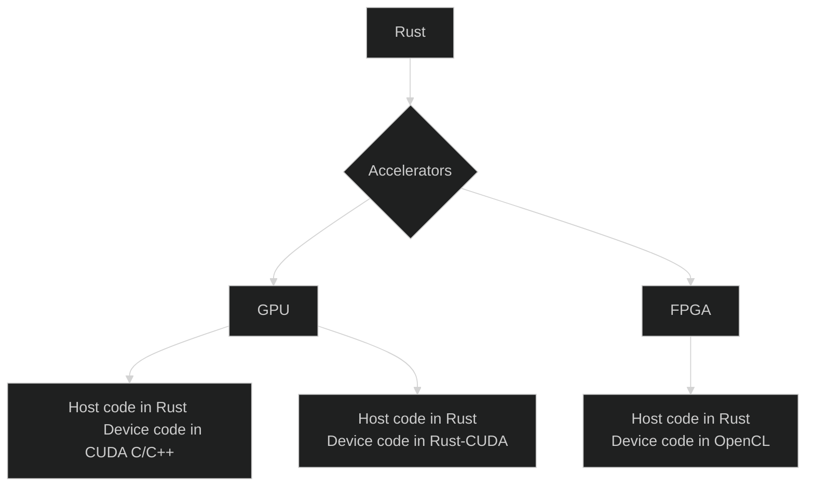

{ align=left width="512" } 
{ align=right width="250" }

     

This tutorial is given in the context of the [Scynergy 2026 event](https://www.scynergy.events/) and [EPICURE](https://epicure-hpc.eu/), participants will explore how to program High-Performance GPU/FPGA cards using Rust. 

## <u>Agenda</u>:

### Why Rust ?

- **Memory safety without garbage collection**:
Rust’s ownership and borrowing system catches bugs like null pointers, use-after-free, and data races at compile time. You get C/C++-level control without the usual foot-guns.

- **High performance**: Rust compiles to native code and has zero-cost abstractions, meaning you can write clean, high-level code that runs as fast as low-level code. Great for systems programming, game engines, and performance-critical services.

- **Fearless concurrency**: Rust makes it hard to write unsafe concurrent code. The compiler enforces thread safety, so many race conditions simply won’t compile. This is a big deal for modern, multi-core software.

- **Excellent tooling and ecosystem**: Cargo (Rust’s build system and package manager) is fast, simple, and a joy to use. Add in great compiler error messages, formatting tools, and a growing ecosystem, and developer experience is genuinely top-tier.

### Why Rust on accelerators ?

- GPU and FPGA bugs are hard to debug and often fail silently or nondeterministically.

- Rust helps by:

    - Preventing data races at compile time

    - Enforcing aliasing rules (huge for shared buffers, DMA, HBM)

    - Making unsafe code explicit, so low-level accelerator code is clearly isolated and audited

This is especially valuable when writing kernels, drivers, or host–device interfaces.

## What will you learn ?

In this course, you will learn to:

- How to build and use OpenCL kernels with Rust on FPGAs and GPUs

- How to build and use CUDA kernels with Rust on NVIDIA GPUs

- How to build and use Rust-CUDA kernels with Rust on NVIDIA GPUs

## What are we going to do ?

In order to practice how to use Rust on MeluXina's accelerators, we will code a small convolution kernel for edge detection:

!!! danger "Remark"
    This course is not intended to be exhaustive. It is **NOT** a Rust course neither an OpenCL/CUDA course.

## Who is the course for ?

- This course is for students, researchers, engineers wishing to discover how to use Rust to program FPGA and GPUs on a High High-Performance Computing platform. 

- Participants should still have some basic notions of Rust programming. 

## Resources

- The [Rust book](https://doc.rust-lang.org/book/)
- The [Rust by example](https://doc.rust-lang.org/rust-by-example/)
- The [opencl3](https://docs.rs/opencl3/latest/opencl3/) crate documentation
- The [cust](https://crates.io/crates/cust) crate documentation

## About this course

{ align=right width="250" }

This course has been developed by the **Supercomputing Application Services** group at LuxProvide in the context of the EPICURE project.

