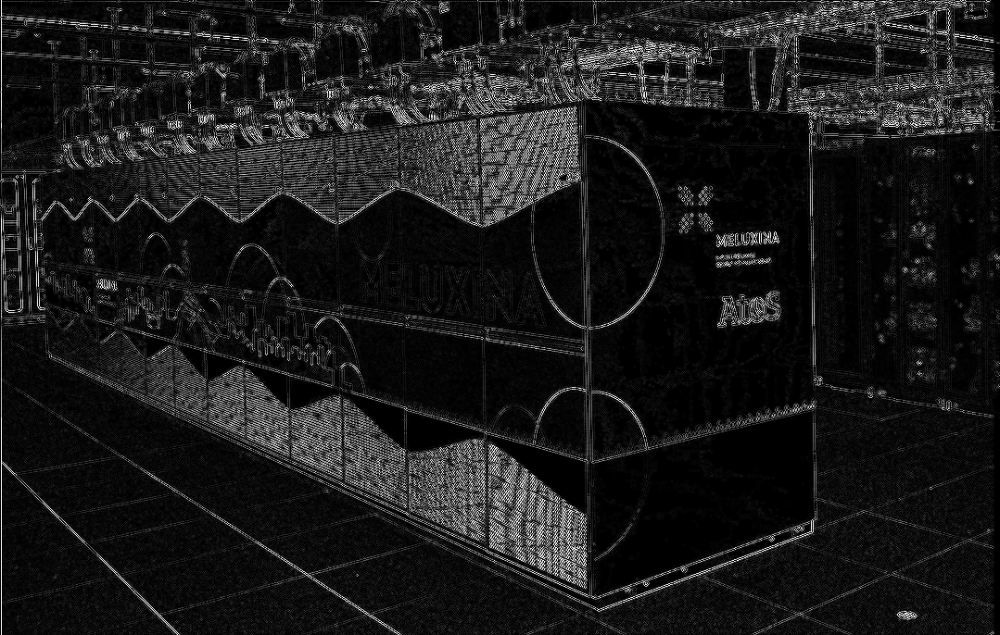

# A Rust host code executing CUDA kernel 

## Host code

```rust title="./code/rust-nvcc/src/main.rs" linenums="1"
--8<-- "./code/rust-nvcc/src/main.rs"
```

## Device code

### C/C++ device code: building the CUDA kernel with `nvcc` 

```cpp title="./code/rust-nvcc/kernels/conv2d_gray_f32.cu" linenums="1"
--8<-- "./code/rust-nvcc/kernels/conv2d_gray_f32.cu"
```

```rust title="./code/rust-nvcc/build.rs" linenums="1"
--8<-- "./code/rust-nvcc/build.rs"
```

### Rust device code: building the CUDA kernel with `Rust-CUDA` 

```rust title="./code/rust-cuda/kernels/src/lib.rs" linenums="1"
--8<-- "./code/rust-cuda/kernels/src/lib.rs"
```

```rust title="./code/rust-cuda/build.rs" linenums="1"
--8<-- "./code/rust-cuda/build.rs"
```

## Execution on MeluXina

### Interactive execution
 
```bash linenums="1"
salloc -A <project_name> --reservation=<reservation_name> -t 30:00 -q default -p gpu
cd RustOnAccelerators/code
source setup_rustgpu.sh
```

=== "Rust-nvcc"
    ```bash linenums="1"
    cd ${CODE_ROOT}/rust-nvcc 
    cargo build --release
    # Execute the code
    ./target/release/rust-nvcc -orust-nvcc-image.png ../../data/original_image.png
    ```


=== "Rust-cuda"
    ```bash linenums="1"
    cd ${CODE_ROOT}/rust-cuda
    cargo build --release
    # Execute the code
    ./target/release/rust-cuda -orust-cuda-image.png ../../data/original_image.png
    ```
### Batch execution

```bash
cd RustOnAccelerators/code
sbatch -A <project_name> --reservation=<reservation_name> launcher-rust-nvcc-cuda.sh
```
## Results


- You should see the following results for both executions:




