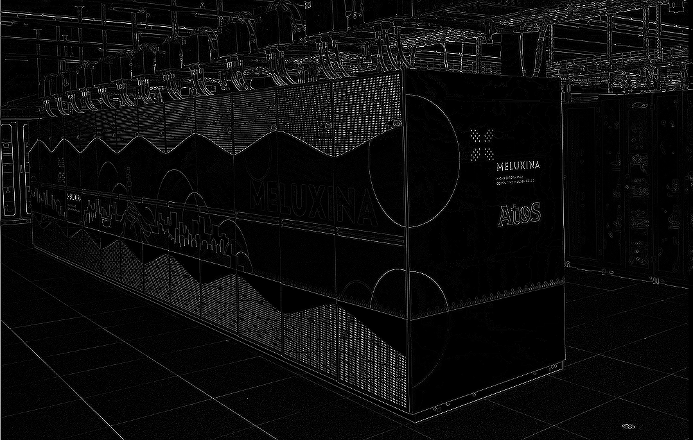

# A Rust host code executing CUDA kernel 

## Host code

- Line 1-4: we import the necessary modules. The **prelude** in Rust is a module that re-exports commonly used types and traits so you can import them all at once.
- Line 7: the `OUT_DIR` environment variable contains the path to the device code build using `build.rs`.
- Line 9-81: the run function applies the following kernel (3 X 3):

      $$
        \begin{bmatrix}
          0 & 1  & 0\\\
          1 & -4 & 1\\\
          0 & 1 & 0
        \end{bmatrix}
      $$

- We used the [cust](https://crates.io/crates/cust) crate, **a Safe, Fast, and user-friendly wrapper around the CUDA Driver API**.

```rust title="./code/rust-nvcc/src/main.rs" linenums="1"
--8<-- "./code/rust-nvcc/src/main.rs"
```

!!! warning "Some difference with the Rust-CUDA version"
    TODO

## Device code

### C/C++ device code: building the CUDA kernel with `nvcc` 

```cpp title="./code/rust-nvcc/kernels/conv2d_gray_f32.cu" linenums="1"
--8<-- "./code/rust-nvcc/kernels/conv2d_gray_f32.cu"
```

```rust title="./code/rust-nvcc/build.rs" linenums="1"
--8<-- "./code/rust-nvcc/build.rs"
```

### Rust device code: building the CUDA kernel with `Rust-CUDA` 

```rust title="./code/rust-cuda/kernels/src/lib.rs" linenums="1"
--8<-- "./code/rust-cuda/kernels/src/lib.rs"
```

```rust title="./code/rust-cuda/build.rs" linenums="1"
--8<-- "./code/rust-cuda/build.rs"
```

## Execution on MeluXina

### Interactive execution
 
```bash linenums="1"
salloc -A <project_name> --reservation=<reservation_name> -t 30:00 -q default -p gpu
cd RustOnAccelerators/code
source setup_rustgpu.sh
```

=== "Rust-nvcc"
    ```bash linenums="1"
    cd ${CODE_ROOT}/rust-nvcc 
    cargo build --release
    # Execute the code
    ./target/release/rust-nvcc -orust-nvcc-image.png ../../data/original_image.png
    ```


=== "Rust-cuda"
    ```bash linenums="1"
    cd ${CODE_ROOT}/rust-cuda
    cargo build --release
    # Execute the code
    ./target/release/rust-cuda -orust-cuda-image.png ../../data/original_image.png
    ```
### Batch execution

```bash
cd RustOnAccelerators/code
sbatch -A <project_name> --reservation=<reservation_name> launcher-rust-nvcc-cuda.sh
```
## Results


- You should see the following results for both executions:


| <center markdown="1"></center> | <center markdown="1"></center>|
|----------------------------------------------------------------|---------------------------------------------------------------|
| <center>Original</center>                                      | <center>Convolution</center>                                  |


## Explore Further

- Try to modify the kernel coefficients
- Try to change the original image
- Adapt the code for Tiled Matrix Multiplication


